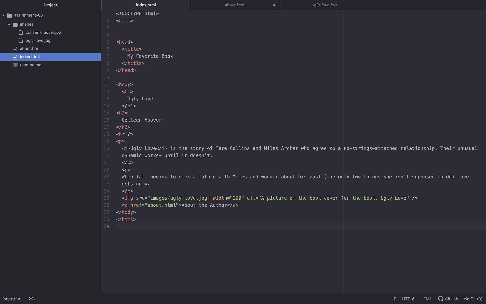

I looked at Netflix in January of 2008. The site was much simpler and had lots of basic graphics explaining how Netflix works. I found this to be the most interesting difference between then and now. I think in 2023 most people are very familiar with Netflix and how it operates. The "Browse Selection" page was also much different and titles were all linked with what appeared to be a embedded url.
