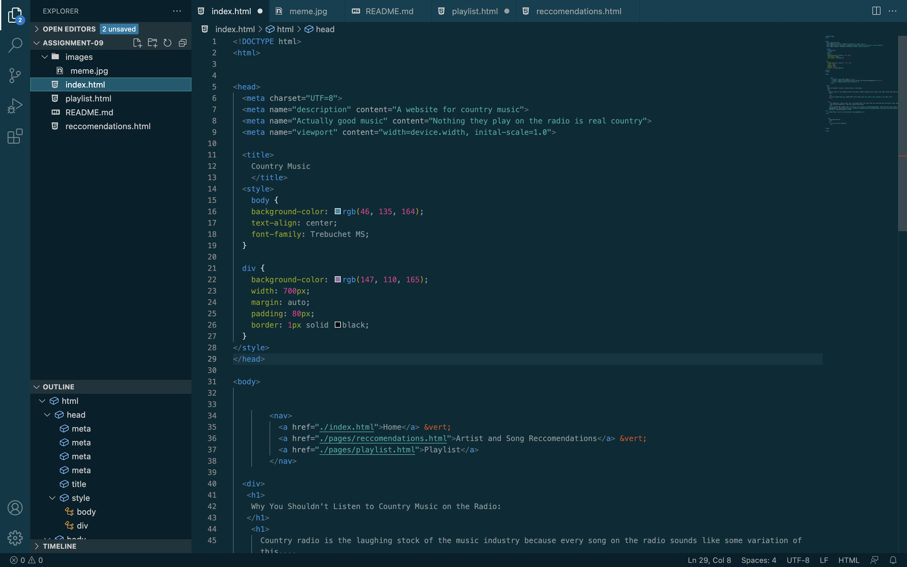

I honestly really enjoyed learning HTML. It definitely frsutrated me at times, but I think this week it really started to click for me and I was the most effective I have been at troubleshooting. To feel it all start to come together is a great feeling!
I'm excited to learn how to make my website look nicer. I'm really curious exactly how professional websites look the way they do and have cool features. 
