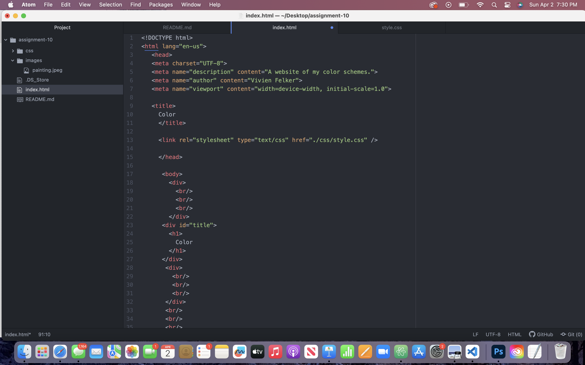

The universal selector "grabs" everything
The element will only adjust style of a certain type.
Class selectors can also be used for an element because it will affect those that are in the same.
ID selectors are for one specific item.

You should use these depending on what you are wanting done style wise and how much of your text you want the style applied to.
